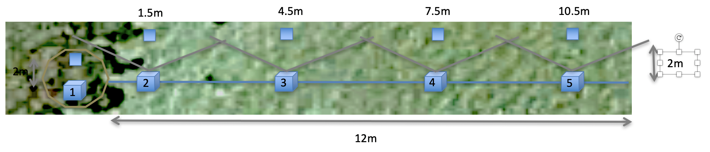

```{r setup, include=FALSE}

library(tidyverse)
library(sciplot)
library(vegan)
library(plotrix)
library(plyr)

```

## Summary

This module focuses on using easily-accessible, low-cost camera traps on coral reefs in the field to capture ecological and behavioral patterns that would be difficult (often impossible) to capture using traditional diver surveys or observations. 

## Goals

* Expose participants to camera traps (i.e., remote, in-situ observation) as a tool in marine science 
* Start thinking about ?s that can be asked/answered using camera traps in their own research
* Provide coral reef field experience

## Components

* Devise/practice camera deployment protocol on land
* Deploy/collect cameras in the field
* Review imagery 
* Discuss strengths/limitations of the approach and any pitfalls encountered

## Study sites

Each group of participants will focus on a unique set of halos surrounding sandbar patch reefs: 

* Group 1: N/A (did deeper patch reefs before we changed the protocol)
* Group 2: KBbay_Halo_01, KBay_Halo_02
* Group 3: KBbay_Halo_03, KBay_Halo_04

## Materials

* GoPros: 5 per halo
* FOV markers: 5 per halo
* tent stakes: 4 per halo
* dive weight: 1 per halo
* transect tape
* slate
* printed metadata sheet
* mesh bag(s) to carry everything

## Gathering imagery

#### Preparation:

* Practice camera deployment on land
* Create datasheets on waterproof paper
* Gather remaining supplies for field trip

#### Setup:

* Navigate to sites using GPS or GoogleEarth on phone/tablet
    + We will approach sites from a side other than where we'll be working (to avoid disrutpion of algae/seagrass/animals)
    + When laying trasect/seting up cameras, be very careful to minimize movement/disruption of sediment
    + Sites we'll be going to will be roughly in this area:

<center>  
  
{ width=90%}  
  
</center> 


* Record metadata (e.g., camera number; reef number; date, depth, etc.) on datasheet(s)
* Choose direction for camera transect so that:
    + Transect moves away from (rather than towards) adjacent reef(s)
    + Transect moves through halo and into algal/seagrass bed
* Position transect tape at edge of reef and unroll in direction chosen, like this:


<center>  
  
{ width=90%}  
  
</center>  

- asd  
- asdfda  


#### Data collection, part 1: Benthic surveys (here)

* Once the transect is laid, turn a GoPro on and:
    + Use your fingers to signify which reef we're doing in front of the camera
          - E.g., Reef/halo 01 would mean holding 1 finger in front of the camera (for a few seconds)
    + Then, start at the reef and swim the length of the transect, through the halo and out into the algal/seagrass 'meadow'
        - Point the camera straight down at the benthos, **being sure to keep the transect tape in the FOV at all times**
        - Swim slowly and hold your camera steady (we will need to extract **clear** still images of the benthos)
        - When you reach the end of the transect tape, turn the camera off

#### Data collection, part 2: Ecological observations

Once benthic survey is done, set up the cameras:

* Place one camera (position 1) on top of the reef, ideally on dead coral
* Plase other cameras (positions 2-5) every 3 metres along the transect facing same direction at the following distances from the reef:
    + (Camera position 1: on the reef)
    + Camera position 2: 1.5m
    + Camera position 3: 4.5m
    + Camera position 4: 7.5m
    + Camera position 5: 10.5m
* Once camera is placed, use transect tape to place FOV marker exactly 2m direclty in front of camera
* Once finished, the whole setup will look something like this (though with fewer replicates and only 2m, instead of 3, between the camera and the FOV marker):


<center>  
  
{ width=90%}  
  
</center> 


Once all cameras and FOV markers are placed, record time on the datasheet and turn all cameras: 

* As you turn each camera on, use your fingers in front of the camera to signify which **reef and camera** it is 
    + Camera are numbered sequentially from camera position 1 (on reef) to camera position _X_ (at end of transect)
    + You will need to specify both reef/halo # and camera position #
        - E.g., Reef/halo 01, camera 2 would mean holding 1 finger in front of the camera (for a few seconds), removing fingers from the camera's view, then holding 2 fingers in front of the camera (for another few seconds)
* Leave cameras running for 35 minutes (min; 5 min 'buffer' + 30 min observation)
* While cameras are running at first site, we will set up second site and set cameras running. 
* We will then pick up cameras in the order in which they were laid (eg, site 1 then site 2)

## Data entry:

* Open the .csv datasheet template ("CameraTraps_template.csv") sent to you by Slack
    + Re-save with your group's name appended to the end of the filename (e.g., "Module1_MeasuringReefs_RotationGroupA.csv")
    + Do not add/delete columns since we will combine datasets later
    + Columns A-I are those you’ll be filling in:
        - site	
        - halo	
        - run	
        - camera_position	
        - camera_number	
        - date	
        - time	
        - depth	
        - tide_stage
* Enter metadata into this datasheet

## Post-field debrief 

* We won't have time in this course to process/analyse the imagery, so we will view a subset of it and discuss. 
* Questions to consider:
    + What worked well?
    + What could be improved?
    + Were you surprised by anything you saw: 
        - in the field?
        - in the imagery?
    + Are there any questions related to your own reserach that could be addressed in some way usimg camera trap data?
    + Any other thoughts/questions??


