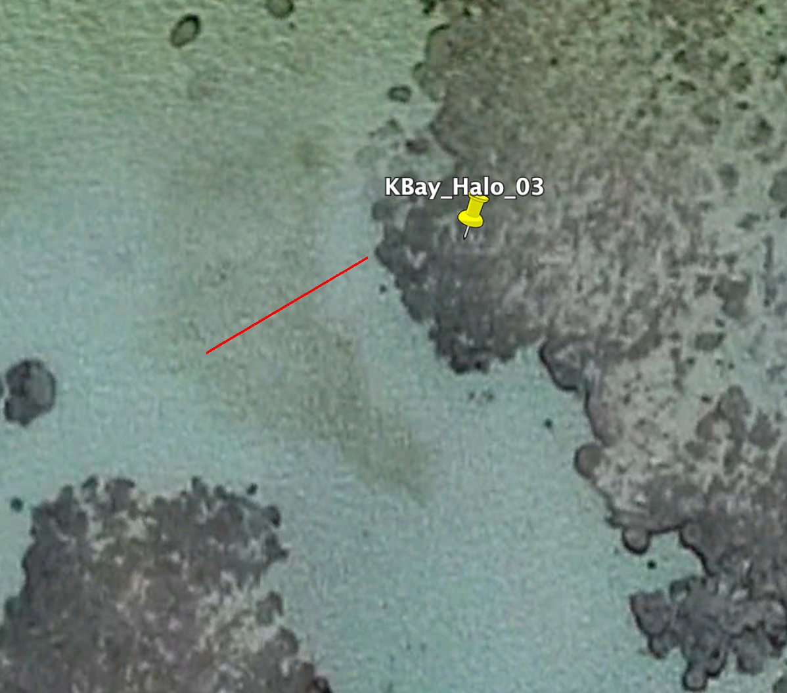

CameraTraps
================
Elizabeth Madin
2019-05-29

Summary:
--------

This module focuses on using easily-accessibl, low-cost camera traps on coral reefs in the field to capture ecological and behavioral patterns that would be difficult (often impossible) to capture using traditional diver surveys or observations.

Goals
-----

-   Expose participants to camera traps (i.e., remote, in-situ observation) as a tool in marine science
-   Start thinking about ?s that can be asked/answered using camera traps in their own research
-   Provide coral reef field experience

Components
----------

-   Devise/practice camera deployment protocol on land
-   Deploy/collect cameras in the field
-   Review imagery
-   Discuss strengths/limitations of the approach and any pitfalls encountered

Study sites
-----------

Each group of participants will focus on a unique set of halos surrounding sandbar patch reefs:

-   Group 1: N/A (did deeper patch reefs before we changed the protocol)
-   Group 2: KBbay\_Halo\_01, KBay\_Halo\_02
-   Group 3: KBbay\_Halo\_03, KBay\_Halo\_04

Gathering imagery
-----------------

Preparation:

-   Practice camera deployment on land
-   Create datasheets on waterproof paper
-   Gather remaining supplies for field trip

Setup:

-   Navigate to sites using GPS or GoogleEarth on phone/tablet
    -   Sites we'll be going to will be roughly in this area:

-   Record metadata (e.g., camera number; reef number; date, depth, etc.) on datasheet(s)
-   Choose direction for camera transect so that:
    -   Transect moves away from (rather than towards) adjacent reef(s)
    -   Transect moves through halo and into algal/seagrass bed
-   Position transect tape at edge of reef and unroll in direction chosen, like this:

-   Every *X* metres, place a camera, with all cameras facing same direction
-   Once camera is placed, use transect tape to place FOV marker exactly 2m direclty in front of camera
-   Once finished, the whole setup will look something like this (though with fewer replicates and only 2m, instead of 3, between the camera and the FOV marker):

Data collection, part 1: Benthic surveys

-   Once all cameras and FOV markers are placed, turn a GoPro on and **slowly** swim the length of the transect
    -   before starting, use your fingers to signify which reef we're doing in front of the camera
        -   E.g., Reef/halo 01 would mean holding 1 finger in front of the camera (for a few seconds)
    -   Start at the reef and move outward, through the halo and out into the algal/seagrass 'meadow'
    -   Point the camera straight down at the benthos, **being sure to keep the transect tape in the FOV at all times**
    -   Swim slowly and hold your camera steady (we will need to extract **clear** still images of the benthos)
    -   When you reach the end of the transect tape, turn the camera off

Data collection, part 2: Ecological observations

-   Once benthic survey is done, clip the benthic survey camera into its holder
-   Record time on the datasheet and turn all cameras
-   As you turn each camera on, use your fingers in front of the camera to signify which **reef and camera** it is
    -   Camera are numbered sequentially from camera position 1 (on reef) to camera position *X* (at end of transect)
    -   You will need to specify both reef/halo \# and camera position \#
        -   E.g., Reef/halo 01, camera 2 would mean holding 1 finger in front of the camera (for a few seconds), removing fingers from the camera's view, then holding 2 fingers in front of the camera (for another few seconds)

Data entry:
-----------

-   Open the .csv datasheet template ("CameraTraps\_template.csv") sent to you by Slack
    -   Do not add/delete columns since we will combine datasets later
    -   Columns with blanks are those you’ll be filling in
-   Open .csv datasheet template and re-save with your group's name appended to the end of the filename (e.g., "Module1\_MeasuringReefs\_RotationGroupA.csv")
-   Enter metadata into this datasheet

Post-field debrief
------------------

-   We won't have time in this course to process/analyse the imagery, so we will view a subset of it and discuss.
-   Questions to consider:
    -   What worked well?
    -   What could be improved?
    -   Were you surprised by anything you saw:
        -   in the field?
        -   in the imagery?
    -   Are there any questions related to your own reserach that could be addressed in some way usimg camera trap data?
    -   Any other thoughts/questions?
